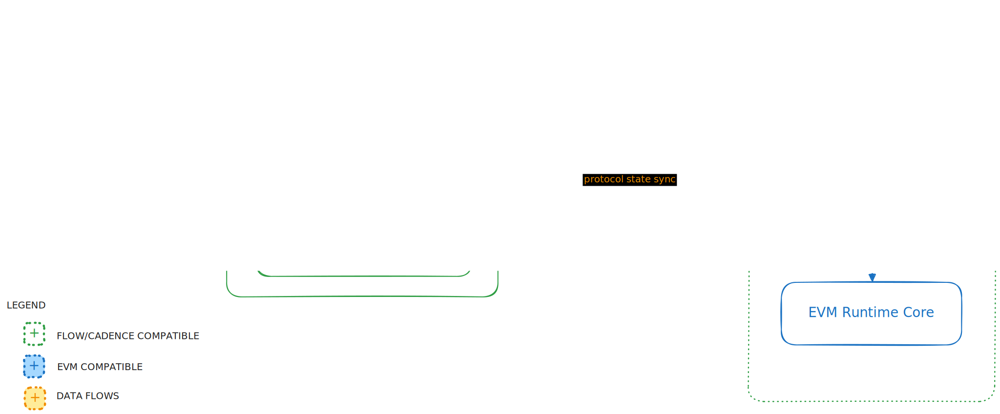

# EVM Gateway

**EVM Gateway enables seamless interaction with EVM on Flow, mirroring the experience of engaging with any other EVM blockchain.**

EVM Gateway implements the Ethereum JSON-RPC API for [EVM on Flow](https://developers.flow.com/evm/about) which conforms to the Ethereum [JSON-RPC specification](https://ethereum.github.io/execution-apis/api-documentation/). The EVM Gateway is tailored for integration with the EVM environment on the Flow blockchain. Rather than implementing the full `geth` stack, the JSON-RPC API available in EVM Gateway is a lightweight implementation that uses Flow's underlying consensus and smart contract language, [Cadence](https://cadence-lang.org/docs/), to handle calls received by the EVM Gateway. For those interested in the underlying implementation details, please refer to the [FLIP #243](https://github.com/onflow/flips/issues/243) (EVM Gateway) and [FLIP #223](https://github.com/onflow/flips/issues/223) (EVM on Flow Core) improvement proposals.

EVM Gateway is compatible with the majority of standard Ethereum JSON-RPC APIs allowing seamless integration with existing Ethereum-compatible web3 tools via HTTP. EVM Gateway honors Ethereum's JSON-RPC namespace system, grouping RPC methods into categories based on their specific purpose. Each method name is constructed using the namespace, an underscore, and the specific method name in that namespace. For example, the `eth_call` method is located within the `eth` namespace. More details on Ethereum JSON-RPC compatibility are available in our [Using EVM](https://developers.flow.com/evm/using#json-rpc-methods) docs.  

No stake is required to run an EVM Gateway and since they do not participate in consensus they have a lightweight resource footprint. They are recommended as a scaling solution in place of centralized middleware JSON-RPC providers.  

### Design



The basic design of the EVM Gateway is as follows:

- Event Ingestion Engine: consumes all Cadence events emitted by the EVM core, filtering for special event type IDs `evm.TransactionExecuted` and `evm.BlockExecuted`. These payloads are decoded and indexed locally. The local index serves all read-only requests to the JSON-RPC including `debug_traceXxxx()` requests.
- Flow Requester: submits Cadence transactions to a Flow Access Node to change the EVM state. EVM transaction payloads received by the JSON-RPC are wrapped in a Cadence transaction. The Cadence transaction execution unwraps the EVM transaction payload and is provided to the EVM core to execute and change state.
- JSON-RPC: the client API component that implements functions according to the Ethereum JSON-RPC specification.


# Building

**Build from source**

```bash
# Make sure you pull the latest changes before running `make build`
cd flow-evm-gateway
git pull origin main
git fetch origin --tags

make build
```
To view the binary version:

```bash
./flow-evm-gateway version
```

To view all the available flags for running the EVM Gateway Node:

```bash
./flow-evm-gateway help run
```

The binary can then be run by passing the necessary flags:

```bash
./flow-evm-gateway run {flags}
```

To run an emulator based local version for development, with the necessary flags set:

```bash
make start-local-bin
```

# Running
Operating an EVM Gateway is straightforward. It can either be deployed locally alongside the Flow emulator or configured to connect with any active Flow networks supporting EVM. Given that the EVM Gateway depends solely on [Access Node APIs](https://developers.flow.com/networks/node-ops/access-onchain-data/access-nodes/accessing-data/access-api), it is compatible with any networks offering this API access.

## Key concepts 

The EVM Gateway's role in mediating EVM transactions over to Cadence is how it accrues fees from handling client transactions. Since 
the gateway submits Cadence transactions wrapping EVM transaction payloads to the Flow Access Node the transaction fee for that must 
be paid by the EVM Gateway.

The account used for funding gateway Cadence transactions must be a COA, not an EOA. `--coa-address` is configured with the Cadence address
of the COA account and the `--coa-key` must belong to the same account. The `--coinbase` account accrues EVM Gateway fees from EVM client
transactions and can be either an EVM EOA or COA address.

It is acceptable to create a single Cadence account for the COA and use the EVM address associated with that for the COINBASE address.

## Running Locally

For local development, first install [Flow CLI](https://developers.flow.com/tools/flow-cli/install). The examples below require no configuration and are intended for local development.

**Run from CLI**

Before running the gateway locally you need to start the Flow Emulator:

```bash
flow emulator
```
_Make sure flow.json has the emulator account configured to address and private key we will use for starting gateway below. Use `flow init` in a new folder for example config._

Please refer to the configuration section and read through all the configuration flags before proceeding.

Then you can start the EVM Gateway with:

```bash
make start-local
```

Note that the gateway will be starting from the latest emulator block, so if the emulator is run before any transactions happen in the meantime, the gateway will not fetch those historical blocks & transactions.
This will be improved soon.

**Run with Docker**

Using Docker for local development is also supported. The following target builds the current source directory into a docker image

```bash
make docker-build-local
```
This target starts the flow emulator and then runs the EVM Gateway using the image built by the above `make` target 
```bash
make docker-run-local
```

**Verify**

To verify the service is up and running:

```bash
curl -XPOST 'localhost:8545'  --header 'Content-Type: application/json' --data-raw '{"jsonrpc":"2.0","method":"eth_blockNumber","params":[],"id":1}'
```

it should return:

```json
{
  "jsonrpc": "2.0",
  "id": 1,
  "result": "0x2"
}
```

## Running on Testnet

Running against the testnet with a local build can be done by pointing the gateway to the testnet ANs and providing the correct configuration.
Please refer to the configuration section and read through all the configuration flags before proceeding.

**Create Flow account to use for COA**

If you don't already have a Flow account you will need to create account keys using the following command. 

```bash
flow keys generate
```

This will output something similar to:

```bash
🔴️ Store private key safely and don't share with anyone!
Private Key 		 3cf8334d.....95c3c54a28e4ad1
Public Key 		 33a13ade6....85f1b49a197747
Mnemonic 		 often scare peanut ... boil corn change
Derivation Path 	 m/44'/539'/0'/0/0
Signature Algorithm 	 ECDSA_P256
```

Then visit https://faucet.flow.com/, and use the generated `Public Key`, to create and fund your Flow testnet account.
Make sure to use the Flow address and the `Private Key` for the `--coa-address` & `--coa-key` flags.

**Run local EVM Gateway connected to Testnet**

Below is an example configuration for running against testnet, with a preconfigured testnet account.

```bash
./flow-evm-gateway run \
--access-node-grpc-host=access.devnet.nodes.onflow.org:9000 \
--access-node-spork-hosts=access-001.devnet51.nodes.onflow.org:9000 \
--flow-network-id=flow-testnet \
--init-cadence-height=211176670 \
--ws-enabled=true \
--coinbase=FACF71692421039876a5BB4F10EF7A439D8ef61E \
--coa-address=62631c28c9fc5a91 \
--coa-key=2892fba444f1d5787739708874e3b01160671924610411ac787ac1379d420f49 \
--gas-price=100
```

The `--init-cadence-height` is the Flow block height to start indexing from. To index the full EVM state, from its beginning, the proper value for this flag for testnet is `211176670`. This is the height where the `EVM` contract was first deployed on testnet, and this is where the EVM state starts from.

If you wish to test this out with your own Access Node, simply set `--access-node-grpc-host` to the DNS or IP where it is hosted.
**Note:** You need to make sure that the testnet Access Node which the gateway is connected to has indexed at least up to Flow block height `211176670`.

For the `--gas-price`, feel free to experiment with different values.

The `--coinbase` can be any EOA address.

Once the EVM Gateway is up and running, verify that indexing works with:

```bash
curl -s -XPOST 'localhost:8545' --header 'Content-Type: application/json' --data-raw '{"jsonrpc":"2.0","method":"eth_blockNumber","params":[],"id":1}'
```

Should return a response similar to:

```json
{
  "jsonrpc": "2.0",
  "id": 1,
  "result": "0x68"
}
```

**Run local EVM GW docker container connected to Testnet**

To use the `make` target to connect a container based gateway instance to testnet requires the following environment variables to be set. 

* `ACCESS_NODE_GRPC_HOST`: access.devnet.nodes.onflow.org:9000 
* `FLOW_NETWORK_ID`: flow-testnet
* `INIT_CADENCE_HEIGHT`: 211176670
* `COINBASE`: FACF71692421039876a5BB4F10EF7A439D8ef61E
* `COA_ADDRESS`: 62631c28c9fc5a91
* `COA_KEY`: 2892fba444f1d5787739708874e3b01160671924610411ac787ac1379d420f49 
* `VERSION`: [_repo commit hash or tag version used when building with docker_]

Once set, this target starts the EVM Gateway for the specified image version and connects it to testnet
```bash
make docker-run
```

## Mainnet and Node Operations

Guidance for EVM Gateway node operations including considerations for mainnet, hardware specs, monitoring setup and troubleshooting 
can be found in the EVM Gateway [node operations docs](https://developers.flow.com/networks/node-ops/evm-gateway/evm-gateway-setup).

## Configuration Flags

The application can be configured using the following flags at runtime:

| Flag                           | Default Value    | Description                                                                                |
|--------------------------------|------------------|--------------------------------------------------------------------------------------------|
| `database-dir`                 | `./db`           | Path to the directory for the database                                                     |
| `rpc-host`                     | `""`             | Host for the RPC API server                                                                |
| `rpc-port`                     | `8545`           | Port for the RPC API server (also same for Websockets)                                     |
| `ws-enabled`                   | `false`          | Enable websocket connections                                                               |
| `access-node-grpc-host`        | `localhost:3569` | Host to the flow access node gRPC API                                                      |
| `access-node-spork-hosts`      | `""`             | Previous spork AN hosts, defined as a comma-separated list (e.g. `"host-1.com,host2.com"`) |
| `flow-network-id`              | `flow-emulator`  | Flow network ID (options: `flow-emulator`, `flow-testnet`, `flow-mainnet`)                 |
| `coinbase`                     | `""`             | Coinbase address to use for fee collection                                                 |
| `init-cadence-height`          | `0`              | Cadence block height to start indexing; avoid using on a new network                       |
| `gas-price`                    | `1`              | Static gas price for EVM transactions                                                      |
| `coa-address`                  | `""`             | Flow address holding COA account for submitting transactions                               |
| `coa-key`                      | `""`             | Private key for the COA address used for transactions                                      |
| `coa-key-file`                 | `""`             | Path to a JSON file of COA keys for key-rotation (exclusive with `coa-key` flag)           |
| `coa-cloud-kms-project-id`     | `""`             | Project ID for KMS keys (e.g. `flow-evm-gateway`)                                          |
| `coa-cloud-kms-location-id`    | `""`             | Location ID for KMS key ring (e.g. 'global')                                               |
| `coa-cloud-kms-key-ring-id`    | `""`             | Key ring ID for KMS keys (e.g. 'tx-signing')                                               |
| `coa-cloud-kms-key`            | `""`             | KMS keys and versions, comma-separated (e.g. `"gw-key-6@1,gw-key-7@1"`)                    |
| `log-level`                    | `debug`          | Log verbosity level (`debug`, `info`, `warn`, `error`, `fatal`, `panic`)                   |
| `log-writer`                   | `stderr`         | Output method for logs (`stderr`, `console`)                                               |
| `rate-limit`                   | `50`             | Requests per second limit for clients over any protocol (ws/http)                          |
| `address-header`               | `""`             | Header for client IP when server is behind a proxy                                         |
| `heartbeat-interval`           | `100`            | Interval for AN event subscription heartbeats                                              |
| `force-start-height`           | `0`              | Force-set starting Cadence height (local/testing use only)                                 |
| `wallet-api-key`               | `""`             | ECDSA private key for wallet APIs (local/testing use only)                                 |
| `filter-expiry`                | `5m`             | Expiry time for idle filters                                                               |
| `traces-backfill-start-height` | `0`              | Start height for backfilling transaction traces                                            |
| `traces-backfill-end-height`   | `0`              | End height for backfilling transaction traces                                              |
| `index-only`                   | `false`          | Run in index-only mode, allowing state queries and indexing but no transaction sending     |
| `metrics-port`                 | `8080`           | Port for Prometheus metrics                                                                |
| `profiler-enabled`             | `false`          | Enable the pprof profiler server                                                           |
| `profiler-host`                | `localhost`      | Host for the pprof profiler                                                                |
| `profiler-port`                | `6060`           | Port for the pprof profiler                                                                |
| `tx-state-validation`          | `""`             | When set to `local-index` will validate EVM transaction state locally                      |


# EVM Gateway Endpoints

EVM Gateway has public RPC endpoints available for the following environments:

| Name            | Value                                  |
|-----------------|----------------------------------------|
| Network Name    | EVM on Flow Testnet                    |
| Description     | The public RPC URL for Flow Testnet    |
| RPC Endpoint    | https://testnet.evm.nodes.onflow.org   |
| Chain ID        | 545                                    |
| Currency Symbol | FLOW                                   |
| Block Explorer  | https://evm-testnet.flowscan.io        |

| Name            | Value                                  |
|-----------------|----------------------------------------|
| Network Name    | EVM on Flow                            |
| Description     | The public RPC URL for Flow Mainnet    |
| RPC Endpoint    | https://mainnet.evm.nodes.onflow.org   |
| Chain ID        | 747                                    |
| Currency Symbol | FLOW                                   |
| Block Explorer  | https://evm.flowscan.io                |

To connect using Websockets you can use the same DNS names as above but change `https://` with `wss://`, eg: `wss://testnet.evm.nodes.onflow.org`

# JSON-RPC API
The EVM Gateway implements APIs according to the Ethereum specification: https://ethereum.org/en/developers/docs/apis/json-rpc/#json-rpc-methods.

**Additional APIs**
- Tracing APIs allows you to fetch execution traces
    * debug_traceTransaction
    * debug_traceBlockByNumber
    * debug_traceBlockByHash
- debug_flowHeightByBlock - returns the flow block height for the given EVM block (id or height)

**Unsupported APIs**
- Wallet APIs: we don't officially support wallet APIs (`eth_accounts`, `eth_sign`, `eth_signTransaction`, `eth_sendTransaction`) due to security
  concerns that come with managing the keys on production environments, however, it is possible to configure the gateway to allow these
  methods for local development by using a special flag `--wallet-api-key`.
- Proof API: we don't support obtaining proofs yet, Flow piggy-backs on the Flow consensus, and hence the Flow proofs can be used to verify
  and trust the EVM environment. We intend to add access to EVM proofs in the future.
- Access Lists: we don't yet support creating access lists as they don't affect the fees we charge. We might support this in the future
  to optimize fees, but it currently is not part of our priorities.

A full list of supported methods is available in the [Using EVM](https://developers.flow.com/evm/using#json-rpc-methods) docs.

# Debugging

## Profiler

The EVM Gateway supports profiling via the `pprof` package. To enable profiling, add the following flags to the command line:
```
--profiler-enabled=true
--profiler-host=localhost
--profiler-port=6060
```

This will start a pprof server on the provided `host` and `port`. You can generate profiles using the following `go tool` commands
```
go tool pprof -http :2000 http://localhost:6060/debug/pprof/profile
```
```
curl --output trace.out http://localhost:6060/debug/pprof/trace
go tool trace -http :2001 trace.out
```

# Contributing
We welcome contributions from the community! Please read our [Contributing Guide](./CONTRIBUTING.md) for information on how to get involved.

# License
EVM Gateway is released under the Apache License 2.0 license. See the LICENSE file for more details.
